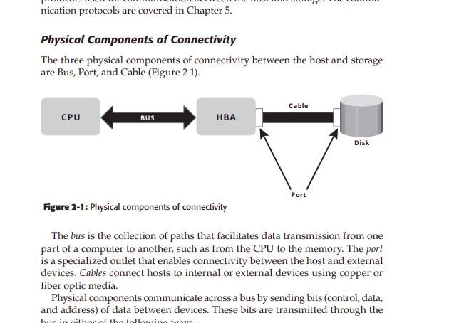

# Module I: Introduction to Information Storage and Data Center
**Subject:** Information Storage Management (ISM)  
**Reference:** Somasundaram & Shrivastava, "Information Storage and Management", EMC/Wiley, 2nd Ed., 2012

---

## 1.1 Information Storage

> **Figure 1-1:** Virtuous cycle of information – creators upload data via networks to centralized storage; users access it and demand more, driving further creation.


### 1.1.1 Data
- **Definition:** Data is a collection of raw facts from which conclusions may be drawn.
- Examples: Handwritten letters, printed books, photographs, movies, bank ledgers, passbooks.
- **Digital Data:** Data stored as strings of 0s and 1s, accessible only after computer processing.


**Factors contributing to growth of digital data:**
1. **Increase in data processing capabilities** – Modern computers can convert media from conventional to digital formats.
2. **Lower cost of digital storage** – Inexpensive storage devices encourage data generation.
3. **Affordable and faster communication technology** – E-mail is faster than traditional mail.

> **Data Explosion:** Inexpensive and easier ways to create, collect, and store data, coupled with increasing individual and business needs, have led to accelerated data growth.

**Examples of Research and Business Data:**
| Type | Description |
|------|-------------|
| Seismology | Earthquake data and related parameters |
| Product data | Inventory, description, pricing, availability |
| Customer data | Order details, shipping, purchase history |
| Medical data | Patient history, X-rays, medication, insurance |

---

### 1.1.2 Types of Data

| Type | Description | Storage |
|------|-------------|---------|
| **Structured** | Organized in rows and columns (tables) | DBMS (databases) |
| **Unstructured** | Cannot be stored in rows/columns — difficult to query | Documents, emails, images, videos |

> **Important:** Over **80%** of enterprise data is **unstructured**, requiring significant storage space and management effort.


**Examples of Unstructured Data:** E-mail attachments, X-rays, manuals, images, contracts, PDFs, audio/video, web pages.

---

### 1.1.3 Information
- **Definition:** Information is the intelligence and knowledge derived from data.
- Businesses analyze raw data to identify trends and plan strategies.
- **Example:** A retailer identifies customers' preferred products by analyzing purchase patterns.
- Information has value when it is processed, shared, and actionable.

---

### 1.1.4 Storage
- **Definition:** Storage is a repository that enables users to store and retrieve digital data.
- Types of storage: Hard disks, CDs, DVDs, USB flash drives, tape drives.
- Type of storage used varies based on the type and usage frequency of data.

---

## 1.2 Evolution of Storage Technology and Architecture

Historically: Centralized computers (mainframe) + tape reels and disk packs → Departmental servers → Networked storage.

**Technology evolution highlights:**

| Technology | Description |
|-----------|-------------|
| **RAID** | Redundant Array of Independent Disks – addresses cost, performance, availability |
| **DAS** | Direct-Attached Storage – connects directly to server (internal or external) |
| **SAN** | Storage Area Network – dedicated high-performance FC network for block-level access |
| **NAS** | Network-Attached Storage – dedicated file serving, connects to LAN |
| **IP-SAN** | Convergence of SAN and NAS – block-level communication over LAN/WAN |

**Evolution path:**  
`Internal DAS → JBOD/RAID → NAS/SAN → IP SAN → Multi-Protocol Router (convergence)`


> **Key insight:** Storage technology evolved from non-intelligent internal storage to **intelligent networked storage** to overcome fragmented, unmanaged islands of information.

---

## 1.3 Data Center Infrastructure

- Organizations maintain data centers for **centralized data processing** across the enterprise.
- Data centers store and manage large amounts of mission-critical data.
- Infrastructure includes: computers, storage systems, network devices, dedicated power backups, environmental controls.

### 1.3.1 Core Elements of a Data Center

Five core elements:

| Element | Description |
|---------|-------------|
| **Application** | Computer program providing logic for computing operations |
| **Database** | DBMS storing data in logically organized tables |
| **Server and OS** | Computing platform running applications and databases |
| **Network** | Data path facilitating communication between clients and servers |
| **Storage Array** | Device storing data persistently for subsequent use |

**Example – Order Processing Flow:**


1. Customer places order through AUI of order processing app on client.
2. Client connects to server over LAN and accesses DBMS to update info.
3. DBMS uses server OS to read/write data to the database on storage.
4. Storage Network provides communication link between server and storage.
5. Storage array performs necessary operations to store data on physical disks.

---

### 1.3.2 Key Requirements for Data Center Elements


| Requirement | Description |
|-------------|-------------|
| **Availability** | Data center elements should ensure accessibility at all times |
| **Security** | Policies preventing unauthorized access; server-specific resource allocation |
| **Scalability** | Ability to allocate more processing/storage without interrupting operations |
| **Performance** | Optimal performance; support processing requests at high speed |
| **Data Integrity** | Error correction codes/parity bits ensure data is written exactly as received |
| **Capacity** | Adequate resources for storing and processing large amounts of data efficiently |
| **Manageability** | Efficient operations through automation and reduced human intervention |

---

### 1.3.3 Managing Storage Infrastructure

Key management activities:
1. **Monitoring** – Continuous collection of information; review of security, performance, accessibility, capacity.
2. **Reporting** – Periodic reports on resource performance, capacity, utilization; business justification and chargeback.
3. **Provisioning** – Providing hardware, software, resources; capacity planning and resource planning.

---

## 1.4 Key Challenges in Managing Information

| Challenge | Description |
|-----------|-------------|
| **Exploding digital universe** | Rate of information growth increasing exponentially; duplication adds to growth |
| **Increasing dependency on information** | Strategic use of information → competitive advantage |
| **Changing value of information** | Information valuable today may become less important tomorrow |

> **Framing policy** to meet these challenges involves understanding the value of information over its lifecycle.

---

## 1.5 Information Lifecycle

- **Definition:** The information lifecycle is the "change in the value of information" over time.
- When data is first created → highest value, most frequently used.
- As data ages → less accessed, less valuable.

**Example – Sales Order Lifecycle:**
```
New Order → Process Order → Deliver Order → Warranty Claim → Warranty Voided
   ↑               ↑              ↑                ↑               ↑
(Create)        (Access)       (Access)          (Migrate)      (Archive/Dispose)
```

---

### 1.5.1 Information Lifecycle Management (ILM)

**Definition:** ILM is a **proactive strategy** that enables an IT organization to effectively manage data throughout its lifecycle, based on predefined business policies.

**Characteristics of an ILM strategy:**
1. **Business-centric** – Integrated with key processes and initiatives of the business.
2. **Centrally managed** – All information assets under the purview of the ILM strategy.
3. **Policy-based** – Encompass all business applications, processes, and resources.
4. **Heterogeneous** – Accounts for all types of storage platforms and operating systems.
5. **Optimized** – Allocates storage resources based on information's value to the business.

#### Tiered Storage
> Tiered storage is an approach to define different storage levels to reduce total storage cost. Each tier has different levels of protection, performance, and data access frequency.

| Tier | Data Type | Media |
|------|-----------|-------|
| Tier 1 | Mission-critical, most accessed | High-performance media, highest protection |
| Tier 2 | Medium accessed, important data | Less expensive media, moderate performance |
| Tier 3 | Rarely accessed, event-specific | Lowest-cost storage |

---

### 1.5.2 ILM Implementation

Four activities:
1. **Classifying** data and applications based on business rules/policies.
2. **Implementing** policies using information management tools.
3. **Managing** the environment using integrated tools.
4. **Organizing** storage resources in tiers aligned with data classes.

**Three-step roadmap to Enterprise-wide ILM:**

| Step | Description |
|------|-------------|
| Step 1 – Networked Tiered Storage | Enable storage networking, classify applications, manually move data across tiers |
| Step 2 – Application-specific ILM | Define business policies, deploy ILM in principal applications, automate |
| Step 3 – Enterprise-wide ILM | Implement ILM across all applications, policy-based automation, full visibility |

---

### 1.5.3 ILM Benefits

1. **Improved utilization** – Use tiered storage platforms; increased visibility.
2. **Simplified management** – Integrated process steps and automation.
3. **Wider backup/recovery options** – Balance business continuity needs.
4. **Compliance** – Know what data needs protection and for how long.
5. **Lower TCO** – Align infrastructure/management costs with information value.

---

## 1.6 Storage System Environment – Components

*(Covered in Chapter 2, but often part of Module 1 syllabus)*

The three main components in a storage system environment:

### 1.6.1 Host
- **Definition:** Computers on which applications run. Range from laptops to server clusters.
- **Physical components:**
  - CPU (ALU + Control Unit + Registers + L1 Cache)
  - Storage (RAM, ROM, hard disks)
  - I/O Devices (keyboard, NIC, HBA)

**HBA (Host Bus Adapter):**
- ASIC board performing I/O interface functions between host and storage.
- Relieves CPU from additional I/O processing workload.
- Provides ports for connectivity to storage devices.

### 1.6.2 Connectivity



**Physical components:**
- **Bus** – Collection of paths for data transmission (CPU ↔ memory ↔ peripherals)
- **Port** – Specialized outlet enabling connectivity between host and external devices
- **Cable** – Connects hosts to internal/external devices using copper or fiber optic media

**Logical components (protocols):**
- **PCI** – Peripheral Component Interconnect; standardizes how expansion cards exchange info with CPU
- **IDE/ATA** – Most popular interface for modern disks (Integrated Device Electronics)
- **SCSI** – Small Computer System Interface; preferred in high-end computers

**Bus types:**
- **System bus** – Carries data from processor to memory
- **Local/I/O bus** – Connects peripherals directly to processor

**Data transmission:**
- **Serial** – Bits transmitted sequentially along a single path
- **Parallel** – Bits transmitted along multiple paths simultaneously

### 1.6.3 Storage
- Magnetic media: Disks, tapes, diskettes
- Optical media: CD-ROM, DVD-ROM
- Solid state: Flash memory cards

**Tape:** Popular for backup; limitations are sequential access, single-user access, wear-out, management overhead.

**Optical disk:** Popular for single-user environments; limited capacity and speed; WORM capability.

**Hard disk:** Most popular for performance-intensive, online applications; supports rapid random access.

---

## 2.2 Disk Drive Components


### Key Components:

| Component | Description |
|-----------|-------------|
| **Platter** | Flat circular disk coated with magnetic material; data encoded by polarizing magnetic domains |
| **Spindle** | Connects all platters; driven by a motor at constant speed |
| **Read/Write Head** | Reads and writes data; detects/changes magnetic polarization |
| **Actuator Arm Assembly** | Positions R/W head at correct location on platter |
| **Controller** | Printed circuit board; manages communication, R/W operations, spindle speed |

**Important disk parameters:**
- **Spindle speeds:** 7,200 rpm, 10,000 rpm, 15,000 rpm
- **HDA:** Head Disk Assembly (sealed case containing platters)
- **Head flying height:** Microscopic air gap between head and platter during operation
- **Landing zone:** Area where R/W head rests when spindle stops (coated with lubricant)
- **Head crash:** When R/W head accidentally touches platter surface → data loss

### Physical Disk Structure:


- **Track:** Concentric ring on platter around spindle; numbered from 0 at outer edge
- **Sector:** Smallest individually addressable unit of storage; typically holds **512 bytes** of user data
- **Cylinder:** Set of identical tracks across all platter surfaces at same radius

> **Note:** Drive manufacturers advertise unformatted capacity. A disk advertised as 500GB holds only 465.7GB of user data.

### 2.2.7 Zoned Bit Recording (ZBR)
- Outer tracks can hold more data than inner tracks (physically longer).
- ZBR groups tracks into **zones** based on distance from center.
- Zone 0 = outermost zone (more sectors per track).
- Inner zones have fewer sectors per track.
- **Result:** More efficient use of available disk space.
- Data transfer rate drops when accessing zones closer to center.

### 2.2.8 Logical Block Addressing (LBA)


- Older drives used physical addresses: **CHS** (Cylinder, Head, Sector).
- **LBA** simplifies addressing by using a linear address to access physical blocks.
- Disk controller translates LBA to CHS; host only needs disk size in blocks.
- Logical blocks mapped to physical sectors on a **1:1 basis**.

**Example:** Drive with 8 sectors/track, 8 heads, 4 cylinders = 256 blocks (LBA 0 to 255).

---

## 2.3 Disk Drive Performance


### Disk Service Time (RS)
**RS = Seek Time (E) + Rotational Latency (L) + Data Transfer Time (X)**

| Component | Description |
|-----------|-------------|
| **Seek Time** | Time to position R/W head on correct track (full stroke, average, track-to-track) |
| **Rotational Latency** | Time for platter to rotate and position sector under R/W head; average = half rotation |
| **Data Transfer Rate** | Average data delivered to HBA per unit time (internal + external) |

**Typical values:**
- Average seek time: **3 to 15 ms**
- Rotational latency at 5,400 rpm ≈ **5.5 ms**; at 15,000 rpm ≈ **2.0 ms**

**Short-stroking:** Using only a subset of available cylinders to minimize seek time (trades capacity for performance).

---

## 2.4 Fundamental Laws Governing Disk Performance

### Little's Law
```
N = a × R
```
- **N** = Total requests in queuing system
- **a** = Arrival rate (I/Os per unit time)
- **R** = Average response time

### Utilization Law
```
U = a × RS
```
- **U** = I/O controller utilization
- **RS** = Service time

**Derived formulas:**
```
Ra = 1/a  (average inter-arrival time)
U = RS/Ra
R = RS/(1-U)  (response time)
NQ = U²/(1-U)  (average queue size)
Time in queue = U × R
```

### Numerical Example:
Given: Arrival rate = 100 I/O/s, Service time = 8 ms

| Parameter | Calculation | Result |
|-----------|-------------|--------|
| Ra | 1/100 | 10 ms |
| U | 8/10 | 0.8 (80%) |
| R | 8/(1-0.8) | 40 ms |
| Queue size | (0.8)²/(1-0.8) | 3.2 |
| Time in queue | 0.8 × 40 | 32 ms |


> **Key relationship:** Response time increases **exponentially** when utilization exceeds **70%** (knee of the curve).

---

## 2.5 Logical Components of the Host

| Component | Description |
|-----------|-------------|
| **Operating System** | Controls all aspects; manages hardware resources; provides storage management |
| **Device Driver** | Special software permitting OS to interact with specific device |
| **Volume Manager** | LVM – manages logical and physical storage; creates partitions and logical volumes |
| **File System** | Hierarchical structure of files; creates, modifies, deletes, accesses files |
| **Application** | Computer program providing computing logic |

### Volume Manager / LVM
- **Physical Volume (PV):** Each physical disk connected to host.
- **Volume Group (VG):** Created by grouping one or more PVs.
- **Logical Volume (LV):** Created within a volume group; acts as virtual disk partition.
- **Physical Extent:** Equal-sized data blocks into which PVs are partitioned.

### File System
Common file systems:
- **FAT32** – Microsoft Windows
- **NTFS** – Microsoft Windows (NT File System)
- **UFS** – UNIX File System
- **EXT2/3** – Linux Extended File System

**UNIX file system metadata:**
- **Superblock:** File system type, size, creation date, count of resources, mount status.
- **Inode:** File length, ownership, access privileges, timestamps, data block addresses.

**Journaling File System:**
- Uses a separate log/journal before making changes to file system.
- On crash → replays journal to recover.
- **Advantages:** Quick file system checks, reduced data loss risk.
- **Disadvantages:** Slightly slower due to extra journal operations.

### Data Access Types:
| Type | Description |
|------|-------------|
| **Block-level** | Data stored/retrieved by specifying logical block address (used by databases) |
| **File-level** | Data accessed by specifying file name and path (abstraction of block access) |
| **Object-level** | Objects are fundamental unit; identified by unique object identifier |

---

## 2.6 Application Requirements and Disk Performance

**IOPS Calculation:**
```
RS = E + L + X
IOPS = 1/RS
```

**Example:** Disk with 5 ms seek, 15,000 rpm, 40 MB/s transfer rate, 32 KB block size:
- E = 5 ms, L = (0.5/15000) × 60000 = 2 ms, X = 32KB/40MB = 0.8 ms
- RS = 5 + 2 + 0.8 = **7.8 ms**
- IOPS = 1/0.0078 = **128 IOPS**

**Number of Disks Required:**
```
N = Max(C, I)
```
- **C** = Disks required to meet capacity
- **I** = Disks required to meet IOPS

**Numerical Example:**
- Capacity: 1.46 TB, IOPS: 9,000, Disk: 146 GB, 180 IOPS max
- C = 1.46 TB / 146 GB = 10 disks
- I = 9000 / 180 = 50 disks
- **N = Max(10, 50) = 50 disks**

---

## Summary – Key Formulas

| Formula | Variables |
|---------|-----------|
| `RS = E + L + X` | Seek time + Rotational latency + Transfer time |
| `IOPS = 1/RS` | Max IOPS per disk |
| `U = a × RS = RS/Ra` | Utilization |
| `R = RS/(1-U)` | Response time |
| `NQ = U²/(1-U)` | Average queue size |
| `Time in queue = U × R` | Wait time |
| `N = Max(C, I)` | Total disks needed |

---

## Module 1 – Quick Revision Points

1. **80% enterprise data is unstructured.**
2. **RAID, DAS, SAN, NAS, IP-SAN** are storage technology evolution milestones.
3. **5 core elements** of data center: Application, Database, Server/OS, Network, Storage.
4. **7 key requirements:** Availability, Security, Scalability, Performance, Data Integrity, Capacity, Manageability.
5. **ILM** = proactive data management strategy with tiered storage.
6. **Information lifecycle** = change in value of information over time.
7. **Disk Service Time:** Seek + Rotational Latency + Transfer Time.
8. **Knee of curve** at **70% utilization** – response time exponential after this.
9. **LBA** replaces CHS addressing for simplicity.
10. **Journaling file systems** ensure quick recovery after crash.
