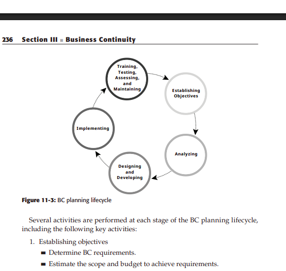

# Module V: Business Continuity – Backup and Recovery
**Subject:** Information Storage Management (ISM)  
**Reference:** Somasundaram & Shrivastava, Ch. 11, 12 – "Information Storage and Management"

---

## Chapter 11: Introduction to Business Continuity (BC)

### 11.1 Information Availability

**Information Availability** = ability to access data when needed, from authorized locations.

### 11.1.1 Causes of Information Unavailability

| Category | Examples |
|----------|---------|
| **Planned downtime** | Hardware/software upgrades, maintenance windows, backups |
| **Unplanned downtime** | Hardware failure, power outage, natural disaster, human error, cyberattack |

**Leading causes of data loss:**
1. Hardware failure (most common – ~44%)
2. Human error (~32%)
3. Software failure
4. Viruses/malware
5. Natural disasters (fire, flood)

### 11.1.2 Measuring Information Availability

**Formula:**
```
Availability = (Total time - Downtime) / Total time × 100%
```

**Example:** System down 1 hour in a year:
- Total time = 8,760 hours/year
- Availability = (8760 - 1) / 8760 × 100% = 99.9886%

**"Nines" of Availability:**

| Availability | Label | Annual Downtime |
|-------------|-------|----------------|
| 99% | 2-nines | 87.6 hours |
| 99.9% | 3-nines | 8.76 hours |
| 99.99% | 4-nines | 52.6 minutes |
| 99.999% | 5-nines | 5.26 minutes |
| 99.9999% | 6-nines | 31.5 seconds |

### 11.1.3 Consequences of Downtime

**Financial impacts:**
- Lost revenue (e-commerce, banking, airlines)
- Regulatory penalties (HIPAA, SOX violations)
- Recovery costs (hardware, labor, data recovery)
- Customer loss and reputational damage

**Industry downtime costs per hour (approximate):**
- Financial: $6 million/hour
- Telecom: $2 million/hour
- Manufacturing: $1.6 million/hour
- Healthcare: $636,000/hour

---

## 11.2 BC Terminology

| Term | Definition |
|------|-----------|
| **RTO (Recovery Time Objective)** | Maximum acceptable time to restore service after a disruption |
| **RPO (Recovery Point Objective)** | Maximum acceptable data loss (how old can the restored data be?) |
| **MTBF (Mean Time Between Failure)** | Average time between hardware failures |
| **MTTR (Mean Time To Repair/Restore)** | Average time to repair/restore after failure |
| **Failover** | Automatic switching to backup system when primary fails |
| **Failback** | Returning to primary system after it's restored |
| **DR Site** | Disaster Recovery site – alternate location for recovery |
| **BIA (Business Impact Analysis)** | Assessment of financial/operational impact of disruption |
| **SLA (Service Level Agreement)** | Agreement defining required availability and performance |

**RTO vs RPO relationship:**
```
Time ──────────────────────────────────────────────────────►
       Last Backup         Failure         Recovery Complete
           │                  │                  │
           │◄───── RPO ──────►│                  │
                              │◄────── RTO ──────►│
```
- **RPO**: Amount of data that could be lost (measured backwards from failure).
- **RTO**: How quickly we need to restore (measured forward from failure).

**DR Site Types:**

| Type | Description | Cost | RTO |
|------|-------------|------|-----|
| **Hot site** | Fully configured, always running; can take over immediately | Highest | Minutes to hours |
| **Warm site** | Partially configured; needs some setup before use | Medium | Hours to days |
| **Cold site** | Facility only; needs full setup when disaster strikes | Lowest | Days to weeks |

---

## 11.3 BC Planning Lifecycle

BC planning is a cyclical, continuous process with 5 stages:

```
       ┌──────────────────────────┐
       │   Establishing Objectives │
       └────────────┬─────────────┘
                    ↓
       ┌────────────────────────┐
       │       Analyzing         │
       └────────────┬───────────┘
                    ↓
       ┌──────────────────────────┐
       │   Designing & Developing  │
       └────────────┬─────────────┘
                    ↓
       ┌────────────────────────┐
       │     Implementing        │
       └────────────┬───────────┘
                    ↓
       ┌──────────────────────────────────────┐
       │  Training, Testing, Assessing,        │
       │  Maintaining (feeds back to start)    │
       └──────────────────────────────────────┘
```



### Stage Activities:

**1. Establishing Objectives:**
- Determine BC requirements.
- Estimate scope and budget.
- Select BC team (SMEs from all business areas).
- Create BC policies.

**2. Analyzing:**
- Collect data profiles, business processes, infrastructure dependencies.
- Identify critical business needs and recovery priorities.
- Risk analysis for critical areas.
- Conduct BIA (Business Impact Analysis).
- Cost-benefit analysis of downtime consequences.

**3. Designing and Developing:**
- Define team structure and roles.
- Design data protection strategies.
- Develop contingency scenarios.
- Develop emergency response procedures.
- Detail recovery and restart procedures.

**4. Implementing:**
- Implement risk management and mitigation (backup, replication).
- Prepare disaster recovery sites.
- Implement redundancy for every resource.

**5. Training, Testing, Assessing, Maintaining:**
- Train employees on backup/replication procedures.
- Train recovery teams on contingency scenarios.
- Test BC plan regularly.
- Assess performance reports.
- Update BC plans regularly.

---

## 11.4 Failure Analysis

**Failure Analysis** = analyzing data center to identify SPOF and implementing fault tolerance.

### 11.4.1 Single Point of Failure (SPOF)
- **SPOF** = Failure of a single component that terminates availability of entire system.
- Examples: Single HBA on server, single FC switch, single storage port, single power supply.


### 11.4.2 Fault Tolerance
- **Fault tolerance** = system design where failure of one component doesn't affect overall availability.
- Achieved through **redundancy** – system fails only if ALL components in redundancy group fail.


**Fault tolerant measures:**
1. Multiple HBAs on servers (dual HBA per server).
2. Multiple fabrics (dual SAN fabrics).
3. Multiple storage array ports.
4. RAID for disk redundancy.
5. Remote storage array (offsite replication).
6. Server clustering (heartbeat monitoring).
7. Redundant network connections.
8. Redundant power supplies with UPS.

## 11.4.3 Multipathing Software
- **Multiple paths** = redundant data paths from server to storage.
- **Multipathing software** (e.g., EMC PowerPath, DM-Multipath):
  - Recognizes and utilizes alternate I/O paths.
  - **Load balancing** – distributes I/O across all available paths.
  - **Path failover** – automatically reroutes I/O when a path fails.


**Load balancing policies (EMC PowerPath):**


1. **Round-Robin** – I/O distributed to each path in rotation.
2. **Least I/Os** – I/O routed to path with fewest queued requests.
3. **Least Blocks** – I/O routed to path with fewest queued blocks.
4. **Priority-Based** – I/O balanced based on reads/writes, priority.

---

## 11.5 Business Impact Analysis (BIA)

**BIA** = process identifying and evaluating financial, operational, and service impacts of disruption.

**BIA tasks:**
1. Identify key business processes critical to operation.
2. Determine attributes: applications, databases, hardware/software.
3. Estimate costs of failure for each business process.
4. Calculate maximum tolerable outage; define RTO and RPO.
5. Establish minimum resources required.
6. Determine recovery strategies and implementation costs.
7. Optimize backup strategy based on priorities.
8. Analyze BC readiness.

---

## 11.6 BC Technology Solutions

After BIA, organizations implement recovery strategies:

| Strategy | Description |
|---------|-------------|
| **Backup and Recovery** | Tape/disk backup; frequency based on RPO, RTO, data change rate |
| **Local Replication** | Copy within same storage array; used for BC and operational restore |
| **Remote Replication** | Copy to remote storage array; BC operations from remote site |
| **Host-based Replication** | LVM/application software maintains copy locally or remotely |


---

## Chapter 12: Backup and Recovery

### 12.1 Backup Purpose

**Three purposes of backup:**

| Purpose | Description |
|---------|-------------|
| **Disaster Recovery** | Backup tapes stored offsite; used to restore at alternate DR site |
| **Operational Backup** | Restore data lost due to accidental deletion, file corruption, etc. |
| **Archival** | Long-term preservation of records for regulatory compliance |

---

## 12.2 Backup Considerations

Key factors when designing backup strategy:

1. **RTO** – How fast must recovery complete?
2. **RPO** – How much data loss is acceptable?
3. **Retention period** – How long to keep backup copies?
4. **Backup media type** – Tape vs disk; accessibility vs cost.
5. **Backup granularity** – Full, incremental, or differential?
6. **Backup window** – When to run backup (off-peak hours)?
7. **File size and count** – More small files → slower backup.
8. **Data compression** – Reduces media usage; text compresses well; JPEG/ZIP don't.
9. **Location of data** – Heterogeneous platforms may need coordination.

---

## 12.3 Backup Granularity (Backup Types)

### 1. Full Backup
- **Copies:** Complete data on production volumes.
- **Frequency:** Usually weekly (e.g., every Sunday).
- **Recovery:** Single backup needed → fastest recovery.
- **Storage:** Requires most space.

### 2. Incremental Backup
- **Copies:** Data changed since **last full OR last incremental** backup.
- **Frequency:** Daily.
- **Recovery:** Need last full + **ALL incrementals** since full → slowest recovery.
- **Storage:** Requires least space (minimum data each day).

### 3. Cumulative (Differential) Backup
- **Copies:** Data changed since **last full backup**.
- **Frequency:** Daily.
- **Recovery:** Need last full + **ONLY LATEST cumulative** → faster than incremental.
- **Storage:** Grows larger each day until next full backup.

### 4. Synthetic Full Backup
- Created offline by combining most recent full backup + all incremental backups.
- No disruption to production I/O.
- Frees network resources from backup process.

### Comparison Table:

| Type | Backup Time | Backup Size | Recovery Speed | Recovery Files Needed |
|------|------------|------------|---------------|----------------------|
| Full | Slowest | Largest | Fastest | 1 tape (full) |
| Incremental | Fastest | Smallest | Slowest | Full + all incrementals |
| Cumulative/Differential | Medium | Medium (grows) | Medium | Full + latest cumulative |

### Example (Incremental Backup):


```
Monday: Full backup (Files 1,2,3)
Tuesday: File 4 added → Incremental: {File 4}
Wednesday: File 3 modified → Incremental: {File 3}
Thursday: File 5 added → Incremental: {File 5}
Friday (failure): Restore = Full(Mon) + Incr(Tue) + Incr(Wed) + Incr(Thu)
```

### Example (Cumulative Backup):
```
Monday: Full backup (Files 1,2,3)
Tuesday: File 4 added → Cumulative: {File 4}
Wednesday: File 5 added → Cumulative: {File 4, File 5}
Thursday: File 6 added → Cumulative: {File 4, File 5, File 6}
Friday (failure): Restore = Full(Mon) + Latest Cumulative(Thu)
```

---

## 12.4 Recovery Considerations

- **RPO determines backup frequency:** If RPO = 1 day → backup at least daily.
- **Retention period:** How long to keep backup copies.
  - Long retention = more storage required = higher cost.
  - Short retention = risk of not having data for requested recovery point.
- **RTO influences media type:** Disk recovery is faster than tape.
- **Full backups for faster restore:** Less dependency on multiple tapes.

---

## 12.5 Backup Methods

### Hot Backup
- Application **running** during backup; users can access data.
- Uses **backup agents** to handle open files.
- **Challenge:** Open files may not be consistent.
- **Open file agents:** Interact with OS to create consistent copies of open files.

### Cold Backup
- Application **stopped** during backup.
- **Advantage:** Consistent backup (no open files).
- **Disadvantage:** Application unavailable to users during backup.

### Point-in-Time (PIT) Copy
- Database **momentarily frozen** while PIT copy created.
- PIT copy mounted on secondary server; backup from secondary.
- **Benefits:** Minimal disruption; consistent copy; production continues quickly.

### Bare-Metal Recovery (BMR)
- Backup includes **all metadata, system info, app configs** for full system recovery.
- Rebuilds: Partitioning, file system layout, OS, applications, configurations.
- Can recover onto **dissimilar hardware**.
- Used for complete system rebuild after catastrophic failure.

---

## 12.6 Backup Architecture

**Components:**

| Component | Description |
|-----------|-------------|
| **Backup Server** | Manages backup operations; maintains backup catalog |
| **Backup Client** | Source of data to be backed up; runs on application servers |
| **Storage Node (Media Server)** | Controls backup devices; writes data to backup media |
| **Backup Device** | Tape library or disk array receiving backup data |
| **Backup Catalog** | Database tracking all backup sessions, media, and file locations |


---

## 12.7 Backup and Restore Operations

### Backup Process (7 Steps):
1. Scheduled backup process starts.
2. Backup server retrieves backup-related info from catalog.
3a. Backup server instructs storage node to load backup media.
3b. Backup server instructs backup clients to send data.
4. Backup clients send data to storage node.
5. Storage node sends data to backup device.
6. Storage node sends metadata and media info to backup server.
7. Backup server updates catalog with status.

### Restore Process (5 Steps):
1. Backup server scans catalog to identify data and client for restore.
2. Backup server instructs storage node to load backup media.
3. Data read from backup device and sent to backup client.
4. Storage node sends restore metadata to backup server.
5. Backup server updates catalog.

---

## 12.8 Backup Topologies

### 1. Direct-Attached Backup
```
[Application Server + Backup Client + Storage Node] ──→ [Backup Device]
                              │
                              │ (Metadata only)
                              ↓
                       [Backup Server] ──── LAN ────
```
- Backup device directly attached to client.
- Only **metadata** sent over LAN (no data traffic on LAN).
- Backup device not shared; limited scalability.

### 2. LAN-Based Backup
```
[App Server + Backup Client] ─── LAN ──→ [Storage Node] ──→ [Backup Device]
                                    │
                                    │ Metadata
                                    ↓
                             [Backup Server]
```


- Data transferred over **LAN** → may affect network performance.
- All servers and backup devices on LAN.
- Can share tape library among multiple clients.

### 3. SAN-Based Backup (LAN-Free)
```
[App Server + Backup Client] ─── FC SAN ──→ [Storage Node] ──→ [Backup Device]
           │                                                          ↑
           └─────── LAN (Metadata only) ─── [Backup Server] ─────────┘
```
- Data travels over **FC SAN** (not LAN).
- LAN only carries metadata (minimal traffic).
- Better performance; no LAN bandwidth impact.
- Frees LAN; but adds I/O burden on SAN.

### 4. Mixed Topology
- Combination of LAN-based and SAN-based.
- Different clients use different paths based on location and requirements.

### 5. Serverless Backup
- Uses SCSI Extended Copy or SAN appliance.
- **No backup server** needed to copy data.
- Reduces impact on application server.
- Uses local/remote replication technologies.

---

## 12.9 Backup in NAS Environments

Four backup methods in NAS environments:

| Method | Description |
|--------|-------------|
| **Server-based backup** | NAS data goes through application server → backup device; high network load |
| **Serverless backup** | Storage node mounts NAS share; reads and writes directly; no app server needed |
| **NDMP 2-way** | Data from NAS head to locally attached tape; metadata over LAN |
| **NDMP 3-way** | Data from NAS head over network to remote tape library; metadata over LAN |


**NDMP (Network Data Management Protocol):**
- Industry-standard TCP/IP protocol for backup/recovery in NAS environments.
- Enables vendor-neutral backup architecture.
- Minimizes network traffic by keeping data local.
- Manages robotics control of tape library over network.

---

## 12.10 Backup Technologies

### 12.10.1 Backup to Tape

**Types of tape technology:**
- **LTO (Linear Tape Open):** Most common; LTO-8 = 12 TB (native), 30 TB (compressed).
- **DLT/SDLT:** Digital Linear Tape; common in past.

**Advantages:**
- Low cost per GB (cheapest storage medium).
- High capacity.
- Portable (physical offsite transport).
- Long data retention (30+ years for LTO).

**Disadvantages:**
- Sequential access (slow random access).
- Mechanical failures (head wear, tape breaks).
- Slow restore times.

### 12.10.2 Physical Tape Library

- Automated tape storage system with **robot arm** for tape handling.
- Contains: Tape drives, tape slots, robotic arm, barcode reader.
- **Capacity:** Hundreds to thousands of tapes.
- **Types:**
  - **Autoloader:** Single-drive library with magazine of tapes.
  - **Tape library:** Multiple drives, large capacity, robotics.


### 12.10.3 Backup to Disk

- **D2D (Disk-to-Disk) backup:** Backup data to disk arrays.
- **Advantages over tape:**
  - Faster backup and restore.
  - Random access (no seek time).
  - No mechanical wear.
  - Easier management.
- **Disadvantages:**
  - Higher cost per GB.
  - Not ideal for long-term archival.

### 12.10.4 Virtual Tape Library (VTL)

- **VTL** = Disk-based backup device that **emulates a tape library**.
- Appears as a physical tape library to backup software.
- Benefits:
  - **Speed of disk** + **compatibility of tape software**.
  - Built-in deduplication reduces storage space.
  - No changes to existing backup software.
  - Can replicate to remote site.
- Used as intermediate stage: `Production → VTL → Physical Tape (offsite)`.


---

## BC Summary – Key Concepts

### RTO/RPO Quick Reference:
- **High-priority (OLTP):** RPO = minutes; RTO = minutes → Need remote replication + hot site.
- **Medium-priority:** RPO = hours; RTO = hours → Need disk backup + warm site.
- **Low-priority:** RPO = days; RTO = days → Tape backup + cold site.

### Backup Schedule Recommendation:
- **Weekly:** Full backup (Sunday night).
- **Daily:** Incremental or cumulative backup (Mon-Sat night).

---

## Module 5 – Quick Revision Points

1. **BC** = Business Continuity – maintaining operations during/after disruption.
2. **RTO** = max time to restore service; **RPO** = max acceptable data loss.
3. **Availability = (Total - Downtime)/Total × 100%.**
4. **5-nines** = 99.999% availability = max 5.26 min/year downtime.
5. **SPOF** = Single Point of Failure; eliminated by redundancy.
6. **Fault tolerance** = system continues operating despite component failure.
7. **BIA** = identifies and evaluates impact of disruption on business.
8. **BC Planning lifecycle:** Objectives → Analyze → Design → Implement → Train/Test.
9. **Hot site** = immediate failover; **Cold site** = cheapest, slowest recovery.
10. **Full backup** = complete copy; slowest to back up, fastest to restore.
11. **Incremental** = only changes since last backup; fastest backup, slowest restore.
12. **Cumulative/Differential** = changes since last full; middle ground.
13. **BMR** = Bare-Metal Recovery; complete system rebuild.
14. **SAN-based backup** = LAN-free; data over FC SAN; metadata over LAN.
15. **NDMP** = Network Data Management Protocol; used in NAS backup.
16. **VTL** = Virtual Tape Library; disk emulating tape; fast + compatible.
17. **Multipathing** = multiple paths to storage; automatic failover + load balancing.
18. **PowerPath** (EMC) = multipathing software with load balancing policies.

---

## Exam Numericals – BC

### Availability Calculation:
System has 4 hours downtime in a year. Find availability:
```
Total time = 365 × 24 = 8760 hours
Availability = (8760-4)/8760 × 100 = 99.9543%
```

### MTBF Calculation:
Network router: failure rate = 0.02% per 1000 hours.
```
Failure rate per hour = 0.0002/1000 = 0.0000002
MTBF = 1/failure rate = 1/0.0000002 = 5,000,000 hours
```

### Backup Storage Calculation:
- 100 GB total data; 10% changes daily.
- Weekly full backup on Sunday; daily incremental Mon-Sat.

Monday-Saturday incremental each day: 100 × 0.1 = 10 GB
Sunday full: 100 GB
Weekly total: 100 + (6 × 10) = 160 GB per week

With cumulative:
Monday: 10 GB, Tuesday: 20 GB, ..., Saturday: 60 GB
Weekly total: 100 + (10+20+30+40+50+60) = 100 + 210 = 310 GB per week
